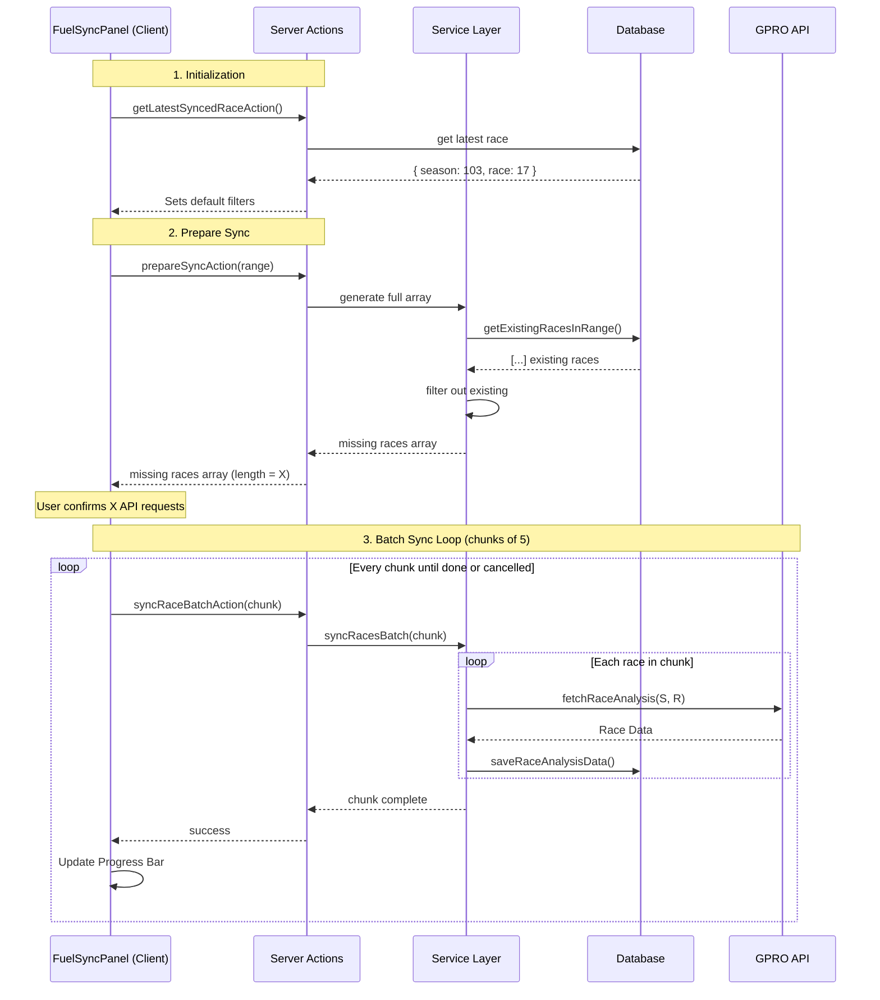

```mermaid
sequenceDiagram
    participant UI as FuelSyncPanel (Client)
    participant SA as Server Actions
    participant SRV as Service Layer
    participant DB as Database
    participant API as GPRO API

    Note over UI,SA: 1. Initialization
    UI->>SA: getLatestSyncedRaceAction()
    SA->>DB: get latest race
    DB-->>SA: { season: 103, race: 17 }
    SA-->>UI: Sets default filters

    Note over UI,SA: 2. Prepare Sync
    UI->>SA: prepareSyncAction(range)
    SA->>SRV: generate full array
    SRV->>DB: getExistingRacesInRange()
    DB-->>SRV: [...] existing races
    SRV->>SRV: filter out existing
    SRV-->>SA: missing races array
    SA-->>UI: missing races array (length = X)

    Note over UI: User confirms X API requests
    Note over UI,API: 3. Batch Sync Loop (chunks of 5)
    loop Every chunk until done or cancelled
        UI->>SA: syncRaceBatchAction(chunk)
        SA->>SRV: syncRacesBatch(chunk)
        loop Each race in chunk
            SRV->>API: fetchRaceAnalysis(S, R)
            API-->>SRV: Race Data
            SRV->>DB: saveRaceAnalysisData()
        end
        SRV-->>SA: chunk complete
        SA-->>UI: success
        UI->>UI: Update Progress Bar
    end
```
