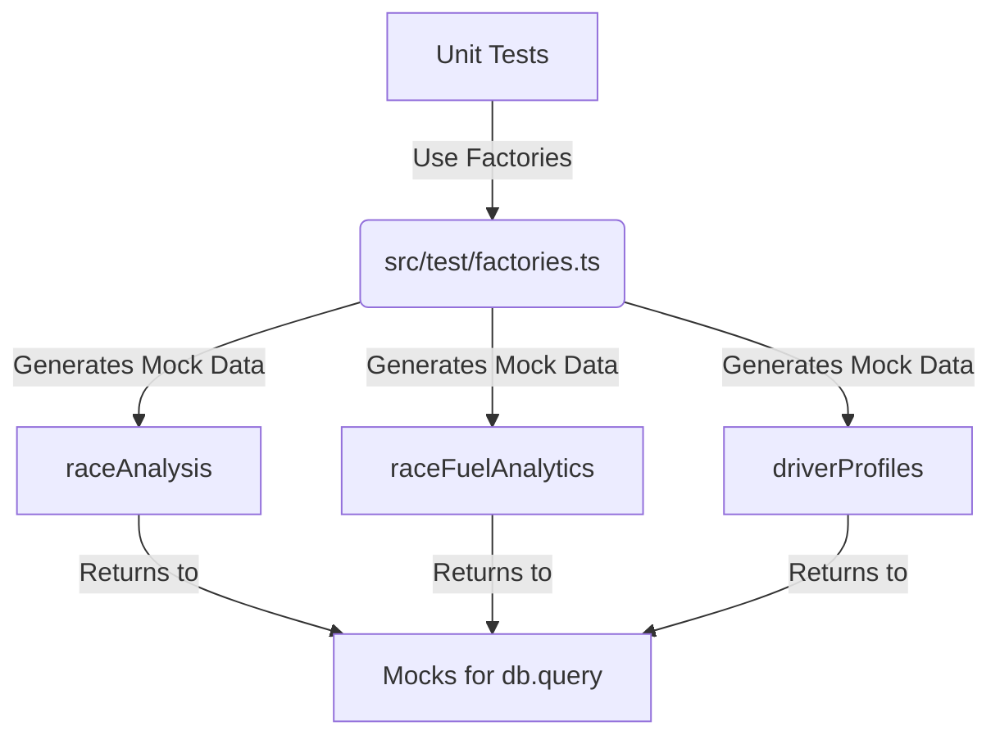

```mermaid
graph TD
    A[Unit Tests] -->|Use Factories| B(src/test/factories.ts)
    B -->|Generates Mock Data| C[raceAnalysis]
    B -->|Generates Mock Data| D[raceFuelAnalytics]
    B -->|Generates Mock Data| E[driverProfiles]
    
    C -->|Returns to| F[Mocks for db.query]
    D -->|Returns to| F
    E -->|Returns to| F
```
