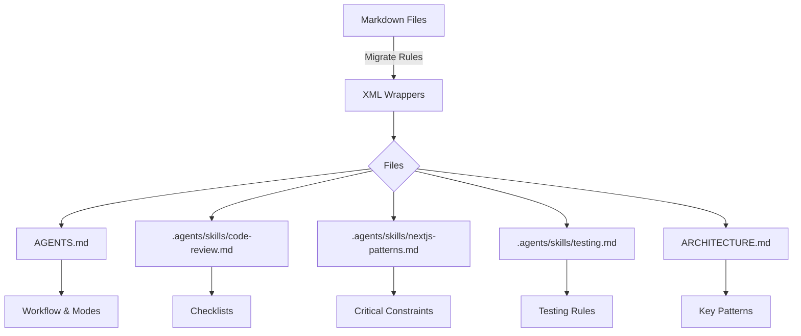

```mermaid
graph TD
    A[Markdown Files] -->|Migrate Rules| B[XML Wrappers]
    B --> C{Files}
    C --> D[AGENTS.md]
    C --> E[.agents/skills/code-review.md]
    C --> F[.agents/skills/nextjs-patterns.md]
    C --> G[.agents/skills/testing.md]
    C --> H[ARCHITECTURE.md]
    
    D --> I[Workflow & Modes]
    E --> J[Checklists]
    F --> K[Critical Constraints]
    G --> L[Testing Rules]
    H --> M[Key Patterns]
```
