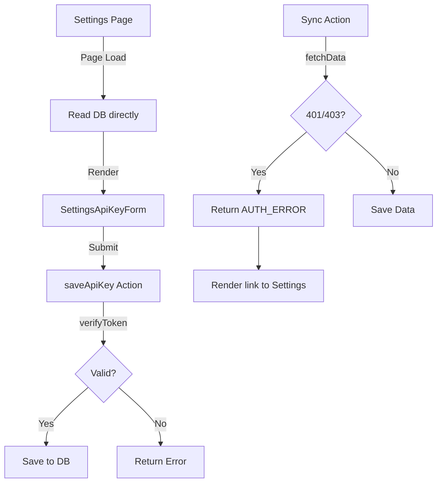

```mermaid
flowchart TD
    A[Settings Page] -->|Page Load| B[Read DB directly]
    B -->|Render| C[SettingsApiKeyForm]
    
    C -->|Submit| D[saveApiKey Action]
    D -->|verifyToken| E{Valid?}
    E -->|Yes| F[Save to DB]
    E -->|No| G[Return Error]

    H[Sync Action] -->|fetchData| I{401/403?}
    I -->|Yes| J[Return AUTH_ERROR]
    J --> K[Render link to Settings]
    I -->|No| L[Save Data]
```
